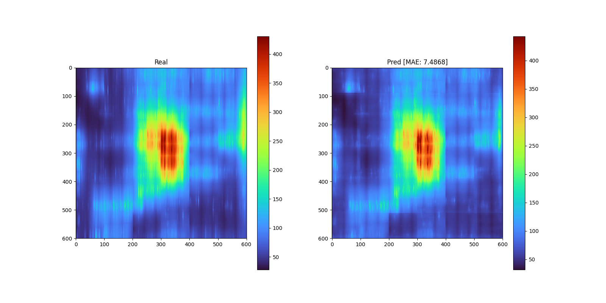

# Alpha ML IRDrop

The repository contains solution for ICCAD23 contest, which took 3rd place. Solution is based on segmentation neural net Unet with MaxVitt backbone.

## Inference

To do inference on contest data you can use script `inference.py`.

**Usage**: 
```bash 
python inference.py current_map.csv pdn_density.csv eff_dist_map.csv netlist.sp ./fuzed_model.pkl irdrop_result.csv
```

**Example**:
```bash 
python inference.py ./example/current_map.csv ./example/pdn_density.csv ./example/eff_dist_map.csv ./example/netlist.sp ./fuzed_model.pkl irdrop_result.csv
```

* Note 1: you can find `fuzed_model.pkl` [here]().
* Note 2: formats for input data can be found in [this document](https://drive.google.com/file/d/162C8PI1umxad3uYrO6aBYgCmjeTQbvR4/view) and in [this folder](./example/).
* Note 3: We don't really use `current_map.csv`, `pdn_density.csv` and `eff_dist_map.csv`. We only take shape of matrix from this. We work with `netlist.sp` directly. 
* Note 4: You can find hidden contest testcases [here](https://drive.google.com/file/d/18moK-FYYGU-LIiu_92eoW4gYRKrqijXW/view).

## Training

1. First download [training data]() (size: ~215 GB) and put it in folder `../input`. Note: this data can be generated. See below.

2. Next you need to generate train/val split for 5 KFold training. 
`python training/step1_create_kfold_split.py`
or you can use [our kfold_split_5_seed_42.csv file](example/kfold_split_5_seed_42.csv). Put it in folder `../output`.

3. After you need to create cache for training for fast reading. Cache will require around ~61 GB. 
`python training/step2_create_training_cache.py`
Cache file are stored in `../cache/all_files/` folder.

4. Now you can run training with
`python training/step3_train_segmentation_net.py`. Results will be stored in `../models/` directory.

5. After training finished you can create fuzed model, which consists of 5 independent models.
`python training/step4_fuze_model.py`
   
## Utils

* `utils/convert.py` - convert .sp file in our format of training data. Useful if you need to add more data to training.
* `utils/draw_irdrop_map.py` - draw IRDrop map and store in png file.

## Dataset generators

You can find information here: [DATASET.md](data_preproc/DATASET.md)

## Results

Comparison of predictions on hidden testcase7 with ground truth:


## Paper and citation

You can find paper with details here: TBD
